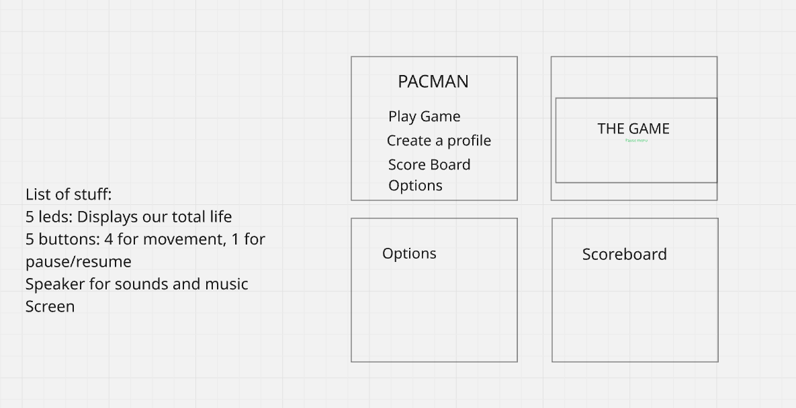

# Pacman

## Description of the Ghosts
There are four ghosts, each of the ghosts have different behaviours. 
- Red (Blinky) - Follows Pac-Man directly during Chase mode, and heads to the upper-right corner during Scatter mode. He also has an "angry" mode that is triggered when there are a certain number of dots left in the maze.
- Pink (Pinky) - Chases towards the spot 2 Pac-Dots in front of Pac-Man. Due to a bug in the original game's coding, if Pac-Man faces upwards, Pinky's target will be 2 Pac-Dots in front of and 2 to the left of Pac-Man. During Scatter mode, she heads towards the upper-left corner. For now would be 4 spots before Pac-Man
- Blue (Inky) - During Chase mode, his target is a bit complex. His target is relative to both Blinky and Pac-Man, where the distance Blinky is from Pacman's target is doubled to get Inky's target. He heads to the lower-right corner during Scatter mode.
- Orange (Clyde) - Chases directly after Pac-Man, but tries to head to his Scatter corner when within an 8-Dot radius of Pac-Man. His Scatter Mode corner is the lower-left.

## Ghost Algorithm
The algorithm for the ghosts are as follows

- The ghosts set their personal targets on each cycle, based on each of their behaviours
- A specified algorithm would be used to check for a path to that target.
- The resulting path from the algorithm would be cached and only updated when pacman changes direction, or when

### Our planned algorithm

The two algorithms to be used are the path-finding algorithms A* algorithm and Breadth-First Search Algorithm
 
## Ghost Scatter Positions

## The Board
Each of the ghost scatter positions are as follows

- Red (Blinky) - Top-Right
- Pink (Pinky) - Top-Left corner
- Blue (Inky) - Bottom-Right corner
- Orange (Clyde) - Bottom-Left corner

## Pacman

## Sections
There are four sections, 
- Home Screen
- Gameplay
- Score Board
- Options
- Pause Menu
- Create User

## Responsibilities
- Joshua
1) Make the ghost struct? (You can make one that is the same for all 4 OR they can each have their own unique struct)
2) Algorithms for the ghost, You will get pacmans postion through my point/pacman struct and then you will do as needed. (Week one)
3) Work on the music and sound

- Ethan
1) Finish Point
2) Finish board/grid
3) -Make the board static and singleton since it's always the same.
4) Make the PacMan and movement
5) Draw the board

- Illa
1) Create basic home screen that matches the image.
2) We dont need a fancy background yet, just get the text to display and highlight current selected text.
3) If you can, consider making the text flash between white and another colour while its highlighted to make it appear alive. - No need to priotise this at the start.
4) If you want after this you can try make the background like look something a home screen pacman would use.

PS: Try to group your menus in structs, that point to other structs that will describe what the current screen looks like and what state must be drawn.
    I might provide you with a basic struct state. 

## Considerations
 - We have 4068 bytes to work with
 - Attempt to make ints uint8_t = 8 bits / one byte
 - In the case that there would not be enough space for an int, then uint16_t
 ### Structs
 - All structs
 - - 4 ghosts and pacman: 
 - - 

# Deliverables
## Next Weekend Deadline (6th March, 2026)
- We have tests this week.... So not much work is expected to be done this week
- Ethan - Would get the board done by next week
- Joshua - Plans to get the BFS done by Sunday
- Illa - Would be able to do the menu by 